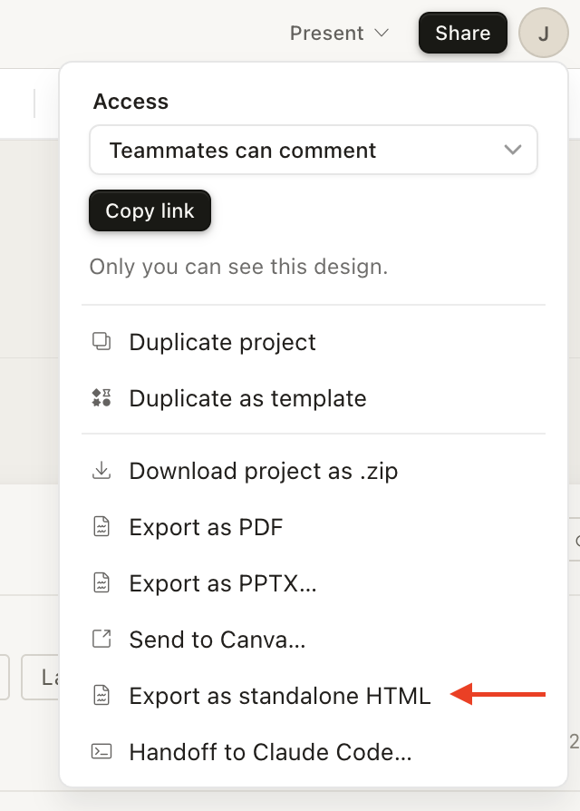

# claude-design-atomic-deconstruct

Reverse-engineers a Claude Design exported HTML file into a token-governed atomic design system with full artifact quartets (README + HTML + PDF + PNG) at every layer.

## Getting started

1. Copy this entire `design-deconstruct` folder into your Claude Code skills directory:
   ```
   cp -r skills/design-deconstruct ~/.claude/skills/
   ```
2. That's it. Run `/design-deconstruct <path-to-concept.html>` in any project.

To rename the skill, update the `name` field in `SKILL.md` and rename the folder to match. The slash command will use whatever name you choose (e.g., `/my-design-deconstruct`).

## Exporting from Claude Design

This skill works with a **standalone HTML export** — not the "handoff to Claude Code" link. The handoff link just gives an agent a URL with no structure; the standalone HTML contains the actual design markup this skill decomposes.

**To export:**

1. In Claude Design, click the **Share** button (top right)
2. Choose **Export as standalone HTML** (not "Share with Claude Code")

   

3. Save the file to your project — typically `.spec/design/concepts/<name>.html`

## Why

Claude Design produces beautiful, high-fidelity HTML — but asking an agent to *reproduce* that design is rough. The standard prompt is thin:

```shell
Fetch this design file, read its readme, and implement the relevant aspects of the design. https://api.anthropic.com/v1/design/h/...?open_file=example.html
```

That's not enough context for an implementation agent. There are no tokens, no component boundaries, no variant inventory — just a monolithic HTML file.

This skill bridges the gap. It takes a standalone exported HTML from Claude Design and decomposes it into a structured atomic design system — from semantic tokens and themes up through atoms, molecules, organisms, and full pages. Each layer gets a documented README, a multi-variant preview, and rendered artifacts. The result is a design system an implementation agent can actually work with.

## What it does

This is an **iterative process**, not a one-shot command. Each time you export a concept from Claude Design, you run this skill against it. The system accumulates: tokens grow, new atoms and molecules are added, organisms and views are extended or updated. Re-running with an updated concept merges changes into the existing system rather than replacing it.

A single invocation decomposes a concept HTML through five sequential phases:

1. **Tokens** — Semantic CSS custom properties, theme JSON files (light + dark), typography modules, and a primitives index page. On re-runs, new tokens are merged additively; existing tokens are preserved unless the concept changed them.
2. **Atoms** — Indivisible components (buttons, inputs, tags, icons). Each gets its own folder with a recipe README and a multi-variant preview page. New atoms are added; existing atoms get new variants if the concept introduces them.
3. **Molecules** — Compositions of 2+ atoms (search bars, card headers, form fields). Compose by class; never redefine atom styling.
4. **Organisms** — Page-section units (nav, feed entries, footers). Compose from molecules + atoms.
5. **Views** — Full pages built from organisms, with responsive breakpoints for desktop and mobile.

Every artifact references theme tokens. Nothing hardcodes colors, spacing, or typography.

### Iterative workflow

1. Design a page in Claude Design, export the HTML
2. Run `/design-deconstruct concept.html` to build the initial system
3. Design another page or iterate on the same one, export again
4. Run `/design-deconstruct updated-concept.html` — the skill detects existing output and merges
5. Repeat until your design system covers all pages and states

## Usage

```
/design-deconstruct <concept-html-path>
/design-deconstruct <concept-html-path> --output <dir>
/design-deconstruct <concept-html-path> --resume-from <phase>
/design-deconstruct <concept-html-path> --force
```

| Flag | Purpose |
|------|---------|
| `--output <dir>` | Override output directory (default: `./.spec/design/system`) |
| `--resume-from <phase>` | Resume from a specific phase (`tokens`, `atoms`, `molecules`, `organisms`, `views`) |
| `--force` | Full regeneration; ignores existing output |

When existing output is detected, the skill presents a phase selector — choose which layers to regenerate. Upward dependencies cascade automatically (e.g., regenerating atoms also queues molecules, organisms, and views). Phases you don't select are preserved as-is.

## Output structure

```
.spec/design/system/
├── tokens/
│   ├── tokens.css            # light + dark custom properties
│   ├── theme.light.json
│   ├── theme.dark.json
│   └── theme.schema.json     # JSONSchema enforcing key parity
├── typography/
│   ├── fonts.css             # @font-face declarations
│   └── type-modules.css      # .type-h1, .type-body, etc.
├── atoms/
│   ├── _preview.css
│   ├── README.md             # atom index + composition matrix
│   └── {name}/
│       ├── README.md
│       ├── {name}.html
│       ├── {name}.pdf
│       └── {name}.png
├── molecules/
│   ├── _atoms.css            # shared atom bundle
│   ├── README.md
│   └── {name}/ ...
├── organisms/
│   ├── README.md
│   └── {name}/ ...
├── views/
│   ├── README.md
│   └── {name}/ ...
├── primitives/               # per-category PNG strips
├── tokens.html               # rendered primitives index
└── manifest.json             # run metadata + audit trail
```

## Quality bar

Every component artifact is verified against these rules at each phase boundary:

- **Zero hex literals** — all colors use `var(--{semantic})`
- **Zero raw typography values** — font-size, weight, line-height, and letter-spacing all use token variables
- **Zero raw px spacing** — padding, margin, and gap use `var(--space-*)`
- **No placeholder content** — previews render real markup from the concept
- **Every variant x state** rendered in both light and dark themes
- **Self-contained HTML** — links to `tokens.css` and `_preview.css`, no CDNs or build step
- **Composition purity** — molecules compose atoms by class, never redefine them

Failures trigger a re-dispatch of the offending component's subagent with the violating lines quoted.

## Regeneration cascade

If a later phase discovers a missing variant at a lower layer, it emits a `VARIANT_REQUEST`. The orchestrator:

1. Pauses the current phase
2. Dispatches a targeted subagent to extend the lower-layer component
3. Regenerates that component's full artifact quartet
4. Resumes the current phase

Cascades are hard-capped at 3 layers of recursion with cycle detection.

## Dependencies

- **`frontend-design:frontend-design`** — provides per-phase aesthetic briefing that steers each component's distinctive look
- **Headless Chrome** — required for PDF + PNG rendering (no fallback)

## Limitations (by design)

This skill does **not** produce runnable application code. It produces an agent-readable design system — HTML previews, token CSS, PNG snapshots, and README recipes.

The intended workflow is to point your planning and implementation agents at the output directory. They can read the PNG files as visual references, the HTML files as structural specs, and the README files as component recipes. This has produced high-fidelity implementations in practice — the design system gives agents enough structured context to reproduce the original concept faithfully.

## Documentation

Detailed docs are loaded on demand during execution:

| File | Loaded when |
|------|------------|
| `docs/PHASE-CONTRACTS.md` | At subagent dispatch time |
| `docs/TOKEN-AUDIT.md` | At phase completion |
| `docs/REGEN-CASCADE.md` | When a `VARIANT_REQUEST` surfaces |
| `docs/RENDER-ARTIFACTS.md` | At component render time |
| `docs/SEMANTIC-TOKENS.md` | By Phase 1 subagent |
| `docs/OUTPUT-SCHEMA.md` | By Phase 1 subagent |
